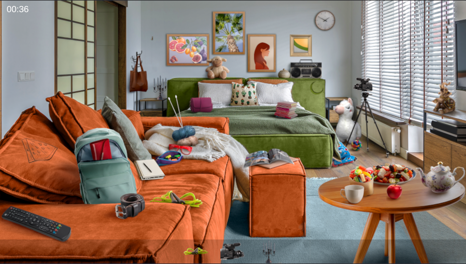
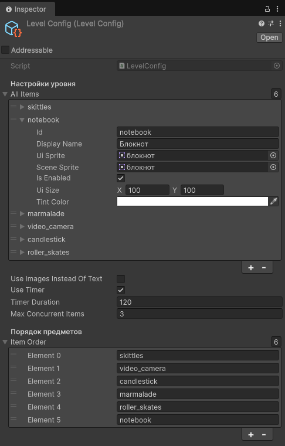

<div align="center">

# 🎮 Hidden Test - Unity Game

**Find the Item Game** | **Тестовое задание для Unity разработчика**

[](https://unity.com/)

</div>

## 📋 Оглавление

- [🎯 Особенности](#-особенности)
- [🛠 Технологии](#-технологии)
- [📁 Структура проекта](#-структура-проекта)
- [🚀 Быстрый старт](#-быстрый-старт)
- [🎮 Скриншоты](#-скриншоты)
- [⚙️ Конфигурация](#️-конфигурация)
- [📦 Сборка](#-сборка)
- [🤝 Вклад в проект](#-вклад-в-проект)
- [📄 Лицензия](#-лицензия)

## 🎯 Особенности

### ✅ Реализованные функции

| Функция | Статус | Описание |
|---------|--------|----------|
| **Поиск предметов** | ✅ | Одновременно 3 предмета для поиска |
| **Таймер** | ✅ | 2 минуты, настраивается через ScriptableObject |
| **UI система** | ✅ | Два режима: текст/изображения |
| **Анимации** | ✅ | Плавное исчезновение предметов |
| **Настройка уровня** | ✅ | ScriptableObject с гибкими параметрами |
| **DI контейнер** | ✅ | Zenject для управления зависимостями |


## 🛠 Технологии

- **Unity 6000.2.10f1** - игровой движок
- **Zenject** - Dependency Injection контейнер
- **C#** - язык программирования
- **Unity UI** - система интерфейса
- **ScriptableObjects** - конфигурация данных

## 📁 Структура проекта

```
HiddenTest/                          # Корень проекта
├── Assets/                          # Ресурсы Unity
│   ├── Scripts/                     # Скрипты C#
│   │   ├── Core/                    # Основные системы
│   │   │   ├── GameController.cs    # Контроллер игры
│   │   │   ├── GameInstaller.cs     # Настройка Zenject
│   │   │   └── GameTimer.cs         # Система таймера
│   │   ├── Gameplay/                # Игровая логика
│   │   │   ├── ItemManager.cs       # Менеджер предметов
│   │   │   ├── UIItem.cs            # Предмет на сцене
│   │   │   └── UIItemPlacer.cs      # Размещение предметов
│   │   ├── UI/                      # Интерфейс
│   │   │   ├── GameUI.cs            # Основной UI
│   │   │   └── UIItemElement.cs     # Элемент списка
│   │   └── Data/                    # Данные
│   │       ├── LevelConfig.cs       # ScriptableObject уровня
│   │       └── FindableItemData.cs  # Данные предмета
│   ├── Scenes/                      # Игровые сцены
│   │   └── MainScene.unity          # Основная сцена
│   ├── Resources/                   # Ресурсы игры
│   │   ├── UI/                      # Иконки UI
│   │   └── FindableItems/           # Спрайты предметов
│   ├── Prefabs/                     # Префабы
│   │   ├── UI/                      # UI префабы
│   │   └── Gameplay/                # Игровые префабы
│   └── Settings/                    # Настройки
│       └── LevelConfig.asset        # Конфигурация уровня
├── Screenshots/                     # Скриншоты проекта ← НОВАЯ ПАПКА
│   ├── gameplay.png                 # Скриншот геймплея
│   └── ui.png                       # Скриншот интерфейса
├── Docs/                            # Документация
├── Packages/                        # Зависимости Unity
├── ProjectSettings/                 # Настройки проекта
└── README.md                        # Этот файл
```

## 🚀 Быстрый старт

### Предварительные требования

- Unity Editor версии **6000.2.10f1**

### Установка

1. **Клонируйте репозиторий:**
   ```bash
   git clone https://github.com/вашлогин/HiddenTest.git
   cd HiddenTest
   ```

2. **Откройте проект в Unity:**
   - Запустите Unity Hub
   - Нажмите **"Add"** → выберите папку `HiddenTest`
   - Используйте версию **6000.2.10f1**

3. **Установите Zenject:**
   ```bash
   # Через Package Manager:
   # Window → Package Manager → "+" → Add package from git URL
   # Введите: https://github.com/modesttree/Zenject.git
   ```

## 🎮 Скриншоты

### Игровой процесс


> *Игрок ищет предметы в игровой области*

### Конфигурация


## ⚙️ Конфигурация

Настройте игру через `Assets/Settings/LevelConfig.asset`:

### Настройка предметов
1. Откройте `LevelConfig.asset` в Unity
2. Добавьте предметы в список `allItems`
3. Для каждого предмета укажите:
   - **ID** - уникальный идентификатор
   - **Display Name** - название для отображения
   - **UI Sprite** - иконка предмета
   - **Prefab** - префаб для игровой сцены
   - **Is Enabled** - включен ли предмет

---

<div align="center">

### Ссылки
[🌐 Билд игры](https://drive.google.com/...) | 
[📧 Контакты](mailto:ваш.email@example.com) | 
[🐛 Issues](https://github.com/вашлогин/HiddenTest/issues)

*Разработано как тестовое задание • © 2025 • [Sergey Akhmetov]*

</div>

